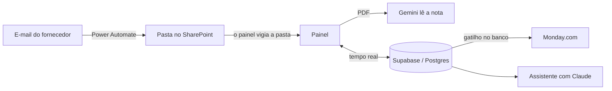

# Plataforma de notas fiscais

## Como era antes

As notas chegavam por e-mail. Alguém abria cada PDF, digitava número, fornecedor, valor e vencimento numa planilha e tinha que lembrar o que já tinha ido para pagamento. Dava para prever onde ia dar errado: nota esquecida até vencer, o mesmo boleto lançado duas vezes por pessoas diferentes, e ninguém sabendo quem mexeu em quê.

## O que eu fiz

Montei um sistema que faz o caminho inteiro. O fornecedor manda o e-mail, um fluxo do Power Automate salva os anexos numa pasta do SharePoint, o painel percebe o arquivo novo, lê a nota e preenche os campos. A equipe só confere e envia. Quando a nota é enviada, ela aparece sozinha na Monday.com para aprovação, com os arquivos anexados.

Está no ar desde julho de 2026, com mais de 800 documentos lançados, e depois levei a mesma solução para mais duas áreas da empresa, cada uma com banco, site e fluxo próprios.

As peças: o painel é uma página web publicada no Netlify; o banco é o Supabase (Postgres, tempo real, armazenamento de arquivos e login); a integração com a Monday é uma função no próprio Supabase, chamada por um gatilho do banco quando a nota vira "Enviado".

## O que deu errado e como resolvi

Essa é a parte de que mais me orgulho, porque tudo isso aconteceu de verdade, com o sistema em uso.

**Notas duplicadas.** Todo mundo da equipe deixa o painel aberto vigiando a mesma pasta. O código antigo perguntava "esse arquivo já existe?", lia a nota (o OCR leva alguns segundos) e só salvava no final. Duas pessoas ao mesmo tempo ouviam "não existe" e criavam duas linhas. Inverti a ordem: antes de ler qualquer coisa, o painel tenta registrar a impressão digital do arquivo (um hash) numa coluna que não aceita repetição. Só quem conseguir registrar segue em frente. Quem decide a corrida é o banco.

**A tela mentia depois que a internet caía.** O tempo real do Supabase não reenvia o que se perdeu durante a queda, e a bolinha de conexão voltava a ficar verde com a tela desatualizada. Agora, toda vez que a conexão volta, o painel recarrega os dados, esperando a rede estabilizar e sem atrapalhar quem está digitando.

**Duas pessoas editando a mesma nota.** A trava só era conferida no navegador, então dois cliques no mesmo instante passavam. Passei a decisão para o banco: só fica com a trava quem conseguir gravar a alteração.

**Nota apagada que voltava sozinha.** Quando alguém excluía uma nota, o arquivo continuava na pasta e o painel criava a nota de novo 25 segundos depois. Hoje a exclusão deixa uma marca antes de apagar o registro, e o painel ignora aquele arquivo.

**Datas trocadas na Monday sem nenhum erro.** Os dois quadros do processo usam o mesmo código de coluna para coisas diferentes: num é vencimento, no outro é data de pagamento. Se o item já tivesse mudado de quadro, eu gravaria vencimento por cima do pagamento. A função agora confere em que quadro o item está antes de escrever.

**Histórico sumindo.** A API do Supabase devolve no máximo mil linhas por vez, sem avisar. O painel mostrava só os registros mais antigos do histórico e escondia os novos. Todas as consultas grandes passaram a buscar em páginas.

## Algumas regras que segui

Nenhum documento some em silêncio: se não der para ler, vira uma pendência com o motivo escrito. Quando o sistema não tem certeza de qual nota um boleto paga, ele pergunta em vez de chutar. E o histórico de alterações não pode ser apagado, porque o próprio banco não deixa.

## O que ainda não está bom

O painel só recebe notas enquanto alguém está com ele aberto no Chrome ou no Edge. Ainda chegam arquivos que não são notas, e a equipe remove à mão; estou testando a IA para filtrar isso. E o painel não tem testes automatizados; só as rotinas de conferência têm.
